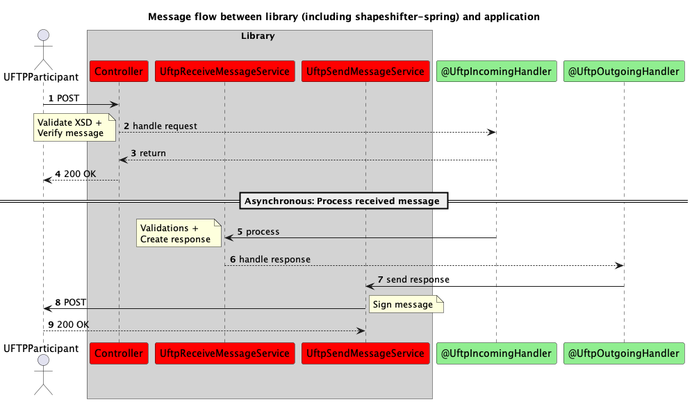

# Shapeshifter Library


The Shapeshifter library is a library written in Java that implements
the [Shapeshifter](https://www.lfenergy.org/projects/shapeshifter/) UFTP (USEF Flex Trading
Protocol) protocol, and the UFTP protocol is part of a larger initiative called USEF, or Universal
Smart Energy Framework. The Shapeshifter library is divided into a number of modules, and all
modules are as technology neutral as possible. The module `shapeshifter-spring` is built on top of
the Spring Boot framework [Spring Boot](https://spring.io/).

The main reasons for using Spring Boot are

1. it is a relatively lightweight framework for setting up microservice endpoints
2. it uses dependency injection, which is used in the `shapeshifter-spring` module, and can be used
   from within your application to assemble building blocks.

We have limited the use of Spring Boot only to the `shapeshifter-spring` module, so if you choose
not to use Spring or Spring Boot in your application, you can simply ignore this module and only use
the other modules. Apart from the Spring Boot dependency in the `shapeshifter-spring` module, the
shapeshifter library aims to make no
assumptions on your technology stack, so you can plug in any ORM framework, any RDBMS or document
database in your development stack and use this library. Furthermore, there are no assumptions on
whether you use synchronous or asynchronous processing in your stack.

The main goal of the Shapeshifter library is to facilitate the process of integrating your system
with other parties that implement the UFTP protocol; the library will take care of basic
functionality like

* Validating incoming UFTP flex messages against the UFTP XSD (XML Schema Definition)
* Validating incoming and (optionally) outgoing UFTP flex messages against a range of business rules
* Sending and receiving flex messages, like flex requests, flex offers, flex orders and test
  messages.
* Verifying your incoming flex messages and signing your outgoing flex messages, thereby
  guaranteeing a safe message exchange
* Providing means to lookup up participant information easily, so you know where to send your
  outgoing UFTP flex messages.

And also important, the open source library does *not* implement the following:

* integration of processing incoming flex messages with your backend, e.g. validating whether an
  incoming flex message adheres to the contract administration in your backend
* integration of triggering the sending of outgoing flex messages
* store any incoming or outgoing messages; in fact, the shapeshifter library does not perform any
  form of persistence, and does not assume anything on your persistence setup. Persistence in any
  form (e.g. storing a record in a Relational database, placing a message on a message queue) should
  be handled by your application.

In general, you need to provide the connection, or 'glue code' between your backend application and
the Shapeshifter library.

The Shapeshifter library is open source, which means that you can not only use the code in your
project, but also that you can contribute to the code if you want. If you want to contribute, your
account will have to be added to the list of contributors, which you can
find [here](https://github.com/shapeshifter/shapeshifter-specification/graphs/contributors)

## Build and test

The Shapeshifter library resides in an open-source repository on Github. You can retrieve the source
code using any Git client of your choice. On the command line, you need to have a git cli (command
line interface), and you can clone the repository with this command:

```
git clone https://github.com/shapeshifter/shapeshifter-library.git
```

This will retrieve the `shapeshifter-library` and copy it to your local disk in the
directory `shapeshifter-library`.

The Shapeshifter library uses [Maven](https://maven.apache.org/) as its dependency management and
build tool, if you want to build the library locally, we recommend that you install the most recent
version of Maven (at time of writing, the most recent version is version 3.9.1)

You can download the most recent version of Maven [here](https://maven.apache.org/download.cgi)

After installing Maven, you can build the library with the following command:

```
mvn install
```

Now, in order to add the Shapeshifter Core dependency to your application, just add
the following snippet to your pom (within the `dependencies` element):

```xml

<dependency>
  <groupId>org.lfenergy.shapeshifter</groupId>
  <artifactId>shapeshifter-core</artifactId>
  <version>${shapeshifter.version}</version>
</dependency>
```

if you are using Spring Boot, and want to use the Shapeshifter Spring Boot module, also add the
following to your pom.xml:

```xml

<dependency>
  <groupId>org.lfenergy.shapeshifter</groupId>
  <artifactId>shapeshifter-spring</artifactId>
  <version>${shapeshifter.version}</version>
</dependency>
```

and if you use Gradle, add the following snippet to your `build.gradle` (within the `dependencies`
block);

```groovy
    implementation("org.lfenergy.shapeshifter:shapeshifter-core:${shapeshifter.version}")
```

and

```groovy
    implementation("org.lfenergy.shapeshifter:shapeshifter-spring:${shapeshifter.version}")
```

if you would like to use the Spring Boot module.

Make sure to replace `${shapeshifter.version}` with the actual Shapeshifter library version.
If you also want to refer to the Shapeshifter library from your test code, you will have to add a
separate dependency to your test dependencies, both in Maven and in Gradle.

If you choose to use Spring/ Spring Boot in your application, you can enable scanning for the
library components, by simply adding the `@EnableShapeshifter` annotation.

```java

@EnableShapeshifter
public class MyUftpImplementation {

  public static void main(String[] args) {
    SpringApplication.run(MyUftpImplementation.class, args);
  }

}
```

## Structure

The Shapeshifter library consists of the following modules:

1. `shapeshifter-api` - this module contains generic classes like converter classes, helper classes
   for date/time calculation, the domain objects generated from the XSDs (using JAXB), and some
   generic entities.
2. `shapeshifter-core` - this is the 'heart' of the Shapeshifter library, it contains several
   classes for dealing with XML, signing and verifying XML messages, several validators, It also
   contains interfaces to retrieve participant information to retrieve the location details to send
   your flex messages.
3. `shapeshifter-spring` - this is the Spring-specific part of the Shapeshifter library, it
   contains several classes for sending and receiving flex messages (like REST controllers). It also
   contains helper classes to retrieve participant information to retrieve the location details to
   send your flex messages.

# Technical description

As mentioned before, the Shapeshifter library is a Java library, and we will give some Java examples
to help you to integrate your backend application with the Shapeshifter library. Note that you are
not restricted to use Java in your backend application, you can use any JVM based language (e.g.
like Kotlin or Scala) to use the Shapeshifter library, but for simplicity we will only present some
Java code examples.

To give an overview, we show the interaction between the different component in the following
sequence diagram;



## The XSD and domain objects

Internally, the Shapeshifter library uses Java domain objects
like `FlexRequest`, `FlexRequestResponse`, `FlexOffer`, `FlexOfferResponse`, `FlexOrder`, `FlexOrder`, `FlexOrderResponse`,
etc. All these Java domain objects are generated from the XSDs (XML Schema Definition). The XSDs are
maintained by the Shapeshifter foundation, and are
published [here](https://github.com/shapeshifter/shapeshifter-specification). The Shapeshifter
foundation aims to keep the XSDs and the library synchronised; currently the most recent version of
the UFTP XSD specification is 3.0.0, and the current Shapeshifter library supports this version.
When a new version of the XSD is published, the Shapeshifter foundation will make sure that the
library is updated accordingly. The XSD's are stored in the following directory:

```shell
shapeshifter-library/shapeshifter-api/src/main/resources
```

## Message integration

Here we will describe the steps to handle incoming flex messages and sending outgoing flex messages.
This example assumes that you are using the `shapeshifter-spring` module of the library.

### Receiving UFTP messages

In order to receive UFTP message, you should add the Spring dependency (`shapeshifter-spring`) to
your application.
Adding this dependency will add an endpoint to your application, where you can receive UFTP
messages. Typically, this endpoint is at: http://localhost:8080/shapeshifter/api/v3/message.

Add a Spring bean to your Spring Boot application to handle incoming UFTP messages:

```java

@Component
public class IncomingMessageHandler implements UftpIncomingHandler<FlexRequest> {

  @Override
  public boolean isSupported(Class<? extends PayloadMessageType> messageType) {
    return FlexRequest.class.isAssignableFrom(messageType);
  }

  @Override
  public void handle(IncomingUftpMessage<FlexRequest> message) {
    // call UftpReceivedMessageService immediately or queue for later processing
  }
}
```

You can have multiple beans for different types of messages, or a single bean that handles all
incoming `PayloadMessageType` messages.

To process a message (asynchronously) you can use the `UftpReceivedMessageService`:

```java
@Autowired 
UftpReceivedMessageService uftpReceivedMessageService;

    uftpReceivedMessageService.process(message);
```

To verify an incoming message, the connector must know the sender's public key. For this you must
provide a `UftpParticipantService` bean in your application:

```java

@Service
public class MyUftpParticipantService implements UftpParticipantService {
  // ...
}
```

Incoming messages are automatically validated. There are a number of validating interfaces that you
should implement. These interfaces are:

1. `UftpMessageSupport` - important interface, contains the method `getPreviousMessage`, is used to
   retrieve the previous message in a conversation.
2. `CongestionPointSupport` - to verify whether a connection point is known in your system (you
   should not accept any flex message for a connection point that is not known to you)
3. `ContractSupport` - to verify whether a contract ID in a flex message refers to an existing
   contract in your system
4. `ParticipantSupport` - for functionality regarding participants (recipients and senders)
5. `UftpValidatorSupport` - contains miscellaneous functionality (e.g. checks on time zone, etc.)

You need to implement one or more Java beans that implements all these 5 interfaces. We here give
two examples;

The class `UftpMessageSupport` is an interface with a number of methods that you should
implement; these methods check a number of UFTP message related functionality on your local system,
that cannot be implemented with a generic library.

```java

@Service
public class MyUftpMessageSupport implements UftpMessageSupport {

  // ...
  @Override
  public Optional<PayloadMessageType> findDuplicateMessage(String messageID, String senderDomain, String recipientDomain) {
    // Add the retrieval of the previous message here....
  }
  
  @Override
  public <T extends PayloadMessageType> Optional<T> findReferencedMessage(UftpMessageReference<T> reference) {
    // Add the retrieval of the referenced message here....
  }  
  
  @Override
  public Optional<FlexOfferRevocation> findFlexRevocation(String conversationID, String flexOfferMessageID, String senderDomain, String recipientDomain) {
    // Add the retrieval of the revocation message here....
  }  
}
```

That should retrieve the previous message given an message ID and the recipient domain.
Another example is for retrieving congestions points, which is in the `CongestionPointSupport`
interface;

```java
public class MyCongestionPointSupport implements CongestionPointSupport {

  @Override
  public boolean areKnownCongestionPoints(Collection<EntityAddress> congestionPoints) {
    // connect this to your local administration of congestion points
  }
}
```

Whether a congestion point is known to your system can only be answered by your system, not by a
generic library, therefore you need to connect the implementation of this method with your
administration of congestion points. The same goes for contract IDs (in the `ContractSupport`
interface); if you receive a message with a certain contract ID, you will have to connect to your
contract administration to verify that you have a active, valid contract with the sending party.

## Custom validations

Add one or more classes (or beans, if you use Spring) to your application that
implement `UftpUserDefinedValidator`: if
you want to add additional validation, than you can add bean classes that
implement `UftpUserDefinedValidator`. next we show an example of `UftpUserDefinedValidator` (if you
use Spring, you can add a `@Component` or `@Service` annotation)

```java

public class MyCustomValidator implements UftpUserDefinedValidator<FlexRequest> {

  @Override
  public boolean appliesTo(Class<? extends FlexRequest> clazz) {
    // here you can filter on the message type that you want to validate on
    return clazz.equals(FlexRequest.class);
  }

  @Override
  public boolean valid(UftpMessage<T> uftpMessage) {
    // implement your validation logic here; return true if valid, false otherwise
  }

  @Override
  public String getReason() {
    // this is the reason of the validation failure, this is returned to the sender if validation fails
    return "My custom validation failed";
  }
}
```

The `appliesTo` methods checks whether to apply the validation; you can specify whether you want to
validate only flex requests, or flex offers, etc. the `valid` method should contain the actual
validation logic; here you can check one or more properties of the message and return `true` if the
message is valid, or `false` otherwise. In the `getReason` method you can specify the reason of the
validation failure, this will be returned to the sender if a message validation fails.
Any custom validations are picked up and called automatically after the standard validations.

### Sending UFTP messages

When the library creates a response message, it must be queued by the application for sending:

```java
public class OutgoingMessageHandler implements UftpOutgoingHandler<FlexRequest> {

  private final QueueService queueService;

  @Override
  public boolean isSupported(Class<? extends PayloadMessageType> messageType) {
    return FlexRequest.class.isAssignableFrom(messageType);
  }

  @Override
  public void handle(OutgoingUftpMessage<T> message) {
    // call UftpSendMessageService immediately or queue message for sending later 
  }

}
```

Again, if you use Spring, you could add a `@Component` or `@Service` annotation to
the `OutgoingMessageHandler` class to assemble your application building blocks easily.
You can have multiple classes (or beans) for different types of messages, or a single bean that
handles all outgoing `PayloadMessageType` messages.

Use the `UftpSendMessageService` class to send UFTP messages to recipients:

```java
UftpSendMessageService uftpSendMessageService;

    var message=new FlexRequest();

    var sender=new UftpParticipant("sender.com",USEFRoleType.DSO);
    var recipient=new UftpParticipant("recipient.com",USEFRoleType.AGR);
    var signingDetails=new SigningDetails(sender,"myPrivateKey",recipient);

    uftpSendMessageService.attemptToSendMessage(message,signingDetails);
```

(you could use the `@Autowired` annotation here if you use Spring). The `attemptToSendMessage` just
sends the message, and does not validate the outgoing message.
If you want to send and validate the outgoing message, you should
use `attemptToValidateAndSendMessage`

```java
UftpSendMessageService uftpSendMessageService;

    var message=new FlexRequest();

    var sender=new UftpParticipant("sender.com",USEFRoleType.DSO);
    var recipient=new UftpParticipant("recipient.com",USEFRoleType.AGR);
    var signingDetails=new SigningDetails(sender,"myPrivateKey",recipient);

    uftpSendMessageService.attemptToValidateAndSendMessage(message,signingDetails);
```

## Verifying and signing messages

See [UFTP Specification](https://gopacs.atlassian.net/wiki/spaces/GOPACS/pages/142901264/UFTP+specification)
.

Example messages are located in `src/test/resources/xml`.

Useful tools for creating a key pair, signing and verifying UFTP messages:

* `org.lfenergy.shapeshifter.core.tools.UftpKeyPairTool`
* `org.lfenergy.shapeshifter.core.tools.UftpSignTool`
* `org.lfenergy.shapeshifter.core.tools.UftpVerifyTool`

Each payload message `*.xml` has a `*Signed.xml` counterpart which contains the same message but
signed (encrypted using the private key) in a `SignedMessage`.
